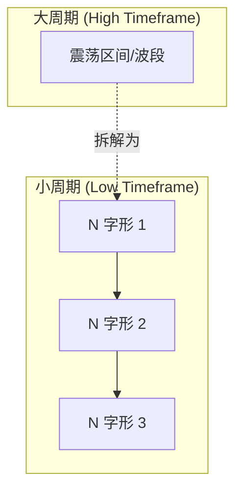
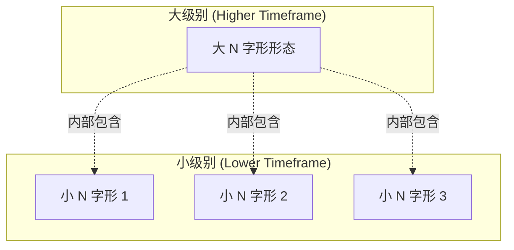
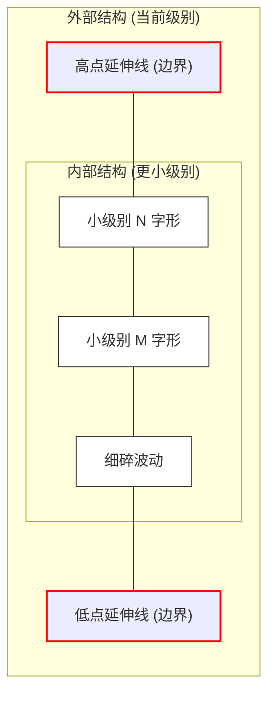
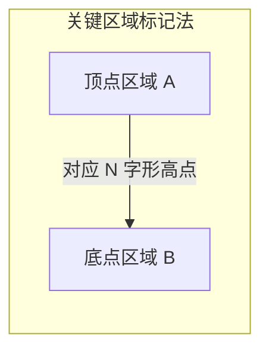
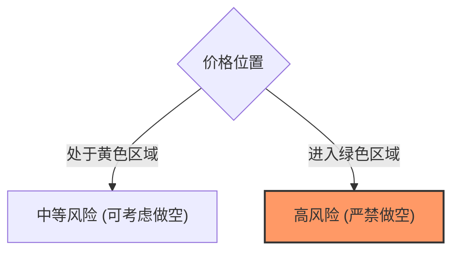
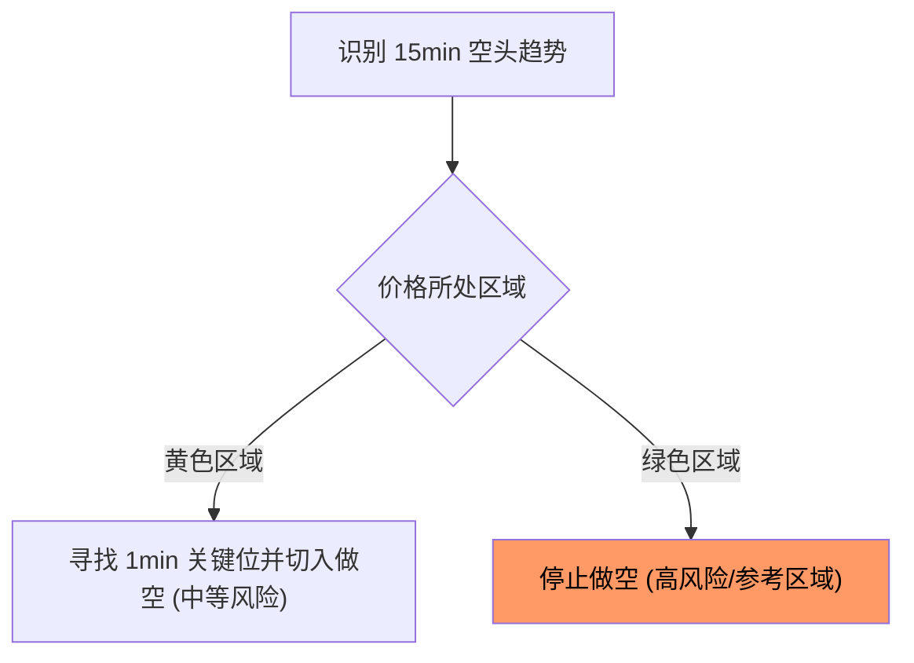
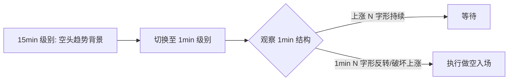
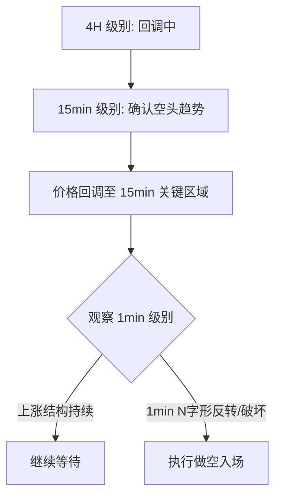

### 交易系统基础：N字形形态

- N字形是交易系统的最基础组成部分
- 学习交易系统的第一步即是从掌握 N 字形开始

### 市场结构分类

市场环境通常可以分为两大类：

- **无趋势市场 (Non-trending Market)**
    - 也被称为震荡市场或弱势市场环境
    - 市场没有明确的方向性
- **有趋势市场 (Trending Market)**
    - 表现为高点不断抬高或低点不断下移等特征
    - **[核心逻辑]** 只要市场处于有趋势的状态，就必然会产生 N 字形形态

### N字形的组成与特征

- **[核心概念]** 趋势型市场是由不同形状的 N 字形连续组成的
    - 无论市场是处于上涨趋势还是下跌趋势，其结构本质上都是由 N 字形构成的
    - 趋势的方向性体现在这些 N 字形形态的排列组合上

### 不同形态的 N 字形

- 趋势市场是由各种形态各异的 N 字形组合而成的
    - 不同的市场环境或市场状态会导致 N 字形呈现出不同的形状
    - 尽管形状不同，但其作为趋势构成单元的本质是一致的

### 震荡市场中的 N 字形

- 即使在震荡市场（无趋势市场）中，N 字形依然存在
- **[单级别视角]** 如果只观察单一时间周期的图表（例如 1 小时图）：
    - 价格在震荡区间内运行，表现为反复的 N 字形波动
    - 当价格从关键位突破并走出震荡区间时，也会形成 N 字形形态
- **[核心结论]** 只要市场存在波动（Price Movement），就会产生 N 字形

### 多周期下的 N 字形结构

- **[核心观点]** N 字形结构在不同时间周期（Timeframes）之间具有嵌套性
- **多周期嵌套关系**：
    - 大周期（如 1 小时图）的震荡区间或波段，在小周期（如 5 分钟图）中会拆解为多个细分的 N 字形结构
    - 即使大周期看起来只是在某个区间内横盘震荡，小周期内部依然在通过 N 字形形态进行价格波动

### 学习 N 字形形态

- **学习的第一步：掌握画法**
    - 能够准确地在市场走势中识别并画出 N 字形
    - 避免随意一笔带过，需清晰勾勒出其结构特征

### N 字形识别的难点

- **[常见问题]** 很多人在尝试画 N 字形时会感到困惑
    - 虽然可以随意画出形状，但往往无法准确识别出真正有效的形态
    - 容易出现“画错了却不知道错在哪里”的情况，导致后续交易逻辑失效
- **[学习目标]** 掌握如何识别出与当前交易级别（Timeframe）相匹配的 N 字形
    - 并非所有的波动都能被称为有效的 N 字形
    - 核心在于找到那个“对应的”形态，而不是盲目地寻找任何形状的波动

### N 字形形态的规模与嵌套

- **形态的规模差异**
    - 在同一个趋势走势中，可以识别出不同规模的 N 字形
    - 既可以观察到较大的、覆盖波段的 N 字形，也可以观察到较小的、局部的 N 字形
- **[核心进阶] 形态的级别嵌套**
    - N 字形不仅在大小上有区别，在时间周期（Timeframe）上也存在嵌套关系
    - 一个较大级别的 N 字形，其内部的波动往往可以被拆解为更小级别周期的 N 字形结构

### N 字形识别的误区：周期不匹配

- **[核心问题]** 许多交易者在尝试画 N 字形时会感到“别扭”或“画不对”
    - 这种困惑通常不是因为形状画错了，而是因为**识别的 N 字形与当前交易的周期（Timeframe）不匹配**
- **周期错位示例**
    - 在 1 小时图表上观察到的某个 N 字形结构，其本质可能只是 5 分钟级别的一个细分形态
    - 如果试图用小周期的波动逻辑去指导大周期的交易，就会产生形态识别上的违和感
- **[学习要点]** 必须学会识别出与你**当前交易级别相对应**的 N 字形
    - 只有当 N 字形的结构与你所处的交易周期逻辑一致时，它才具备交易参考价值

### N 字形形态的级别匹配

- **[核心痛点]** 为什么画出的 N 字形感觉“别扭”或“不对”？
    - 因为画出的 N 字形级别与当前正在交易的级别不匹配
    - 例如：在进行短线交易时，却试图套用大周期的 N 字形结构，或者反之
- **[关键原则]** 必须识别并画出与当前交易级别（Timeframe）相对应的 N 字形
    - 只有级别匹配，形态的指导意义才成立

### 双级别周期交易实践

- **[实战策略]** 使用两个不同级别的周期进行协同观察
- **个人交易案例**：
    - 组合一：使用 **4 小时** 级别作为大背景，配合 **15 分钟** 级别进行操作
    - 组合二：使用 **15 分钟** 级别作为大背景，配合 **1 分钟** 级别进行操作

### 如何确认 N 字形级别

- **[核心挑战]** 识别出当前画出的 N 字形到底是属于哪个级别的形态
    - 容易将更小级别的波动误认为是当前交易级别的 N 字形
- **判断逻辑**：必须明确区分你所观察到的 N 字形是属于：
    - 当前交易级别 (Current Timeframe)
    - 更小级别 (Lower Timeframe)
    - 更大级别 (Higher Timeframe)
- **[学习资源]** 具体的判断方法可参考之前的课程
    - 系列课程：**《多位教育技术分享》**
    - 具体章节：**第一节** 或 **第二节**（内容涉及如何区分不同级别的 N 字形）

### 外部结构与内部结构

- **[核心概念]** 在识别 N 字形时，必须区分“外部结构”与“内部结构”
- **外部结构 (External Structure)**
    - 指的是当前交易级别（Timeframe）所对应的 N 字形形态
    - 只有识别出外部结构，才能为当前级别的交易提供有效的逻辑支撑
- **内部结构 (Internal Structure)**
    - 指的是当前级别内部，由更小级别周期所构成的 N 字形波动
- **[常见错误]** 误将“内部结构”当做“外部结构”来交易
    - 如果你试图在当前级别交易一个本质上属于更小级别的内部结构，那么你的交易逻辑就会出现偏差
    - 这种错误会导致你对市场趋势的判断失准，因为你关注的是细分波动而非当前周期的主要趋势

> **总结**：你应当画出的是当下时间周期对应的**外部结构** N 字形，而不是被困在小级别的**内部结构**中。

### 案例演示：蓝色与橘色线段

- **视觉案例解析**
    - 在具体的图表案例中，通过不同颜色的线段直观展示级别嵌套：
    - **蓝色线段**：代表 **4 小时级别** 的 N 字形结构（即外部结构）。
    - **橘黄色线段**：代表 **15 分钟级别** 的 N 字形结构（即内部结构），填充在蓝色线段构成的波段内部。
- **判断逻辑**
    - 通过观察线段的粗细和覆盖的范围，可以快速区分当前形态属于哪个级别。
    - 大级别的蓝色 N 字形内部，往往包含多个小级别的橘色 N 字形波动。

### 识别当前级别的 N 字形

- **[核心操作] 明确高点边界**
    - 在识别一个上涨波段（如 15 分钟级别 N 字形）时，首先要明确该波段的高点
    - 将该高点向右水平延伸，划出一条明确的界限线
- **[核心逻辑] 区分外部与内部运动**
    - **外部结构运动**：指当前交易级别所对应的、由该 N 字形主导的趋势运动
    - **内部结构运动**：指在上述高点界限空间内产生的任何后续波动
        - 无论后续产生的 N 字形看起来多么清晰，只要它发生在当前级别高点划定的空间内，它本质上都是**更小级别**的结构
        - 这些波动属于“内部结构”，而非当前交易级别的“外部结构”

> **关键结论**：一旦划定了当前级别 N 字形的高点，该空间内的所有波动都应被视为内部结构，而非当前级别的有效形态。交易者应当关注外部结构的延续或反转，而不是被内部结构的细碎波动干扰。

### 识别更大级别的 N 字形

- **[判断逻辑]** 如何确认价格已经脱离了“内部结构”，进入了“更大级别”的形态？
    - 观察价格是否打破了之前的关键点位（如前高）
        
    - **[趋势延续的条件]**：
        
        1. 价格在当前空间内进行 N 字形结构运动（回调/震荡）
        2. 价格发生反转，并成功**打破（Breakout）**之前的关键高点
        3. 一旦打破关键点位，即可认为该大级别的 N 字形形态正在**延续**，价格进入了整体趋势的扩张阶段

### 案例演示：延伸与观察

- **[核心操作] 延伸关键点位**
    - 在画出清晰的 N 字形结构（如 4 小时级别）后，下一步是将其关键点位（如高点）向右水平延伸。
- **[观察目的]**
    - 通过延伸线观察价格的后续运动：
        - 如果价格在延伸线范围内波动，属于**内部结构**（如 15 分钟级别的嵌套）。
        - 如果价格突破延伸线，则可能进入**更大级别**的形态延续。
- **[前提条件]**
    - 必须先确保当前级别的 N 字形结构连接清晰，才能准确进行后续的延伸和判断。
- **[核心操作] 划定价格边界**
    - 将当前级别 N 字形波段的**高点**和**低点**分别向右水平延伸，划出明确的边界线
    - **[判断标准]** 只要价格后续的波动没有穿过这两条边界线，所有的波动都属于**内部运动 (Internal Movement)**
        - 无论这些波动看起来多么像 N 字形或 M 字形，只要它们处于边界内，它们本质上都是**更小级别**的结构
- **[交易警示] 区分不同周期的形态**
    - 在进行交易时，必须严格区分大周期、中周期和小周期的 N 字形形态
    - **错误行为**：将小周期的内部波动误认为是当前交易级别的有效结构，这会导致交易逻辑混乱

> **核心准则**：价格必须**穿透**（打破）上述划定的高点或低点边界，才能被视为脱离了内部结构，进入了当前级别或更大级别的形态运动。否则，所有波动皆为内部结构。

### 核心技能：同级别形态的精准绘制

- **[基本要求]** 学习交易系统的第一步，也是最基础的一步，是必须学会**在同级别图表中画出有效的 N 字形**
- **[潜在风险]** 如果无法准确识别当前级别的形态，就会产生底层逻辑错误
    - 例如：原本想在 4 小时级别进行交易，却误将 15 分钟级别的波动当成了 4 小时级别的 N 字形形态
    - 这种“级别混淆”会导致交易逻辑从根基上发生偏差

> **核心原则**：画图时必须时刻明确自己当前所处的图表级别，确保所画的 N 字形与当前交易级别（Timeframe）保持一致。

### 寻找正确的关键区域

- **[进阶步骤]** 在画出正确的当下级别 N 字形后，下一步需要识别出正确的关键区域
- **[具体方法]** 讲师通常习惯标记**两个区域**：
    - **顶点区域 (Area A)**：对应 N 字形的高点
    - **底点区域 (Area B)**：对应 N 字形的低点
- **[核心目标]** 从单纯标记“点”进阶为识别“区域”，以便更精准地锁定当前级别的支撑与压力区间

### 内部运动与级别界定

- **[核心判定逻辑]** 价格在当前级别划定的边界内进行的任何波动，都被定义为**内部运动 (Internal Movement)**
    - 只要价格没有**穿透**（突破）上方的高点延伸线或下方的低点延伸线
    - 无论在边界内产生多少个 N 字形或 M 字形结构
    - 这些结构本质上都是**更小级别**的形态（例如：在 4 小时级别的边界内，出现的可能是 15 分钟或 1 分钟级别的结构）
- **[交易者的级别意识]** 在进行交易绘图时，必须严格区分不同周期的形态
    - **[重要提醒]** 绝对不能混淆大、中、小周期的 N 字形，否则会因误判结构级别而导致错误的交易决策
- **[讲师的交易周期习惯]** 使用三级别周期体系进行观察与交易：
    - **大周期**：4 小时 (4H)
    - **中周期**：15 分钟 (15M)
    - **小周期**：1 分钟 (1M)

### 识别正确的关键区域

- **[核心概念] 关键区域 (Key Areas)**
    - 将 N 字形形态的**顶点 (A)** 和**底点 (B)** 视为具有厚度的**关键区域**，而非单一的精确点位。
    - 这种标记方式能更准确地反映市场在关键支撑与压力位的实际运行逻辑。

### 关键区域的绘制与用途

- **[绘制方法]** 锁定 N 字形形态的**顶点 (A)** 和 **底点 (B)** 所在的水平位置，绘制出上下两条水平线
    - 将离散的“点”转化为一个具有厚度的**矩形空间**
- **[核心用途]** 该区域具有双重功能：
    - **交易区域 (Trading Area)**：当价格进入此区域时，是需要重点观察价格行为（Price Action）的关键地带
    - **参考区域 (Reference Area)**：作为后续判断趋势延续或反转的重要参考依据
- **[实战逻辑]** 如果你正在进行 4 小时级别的交易，当价格进入 4 小时的关键区域时，你应该切换到更小级别（如 15 分钟）来观察：
    - 该位置是否会出现反转信号？
    - 该位置是否能提供一笔高质量的买入/卖出机会？
- **[核心目标]** 利用大周期（如 4 小时）在关键位置的推动力，去捕捉并跟随小级别（如 15 分钟）结构性的上涨或下跌

### 利用小级别结构预判大级别趋势

- **[核心逻辑]** 通过观察小级别（如 15 分钟）形态的转变，来确认大级别（如 4 小时）波段的结束或反转
- **[实战判定步骤]** 以 4 小时级别的上涨波段为例：
    - **观察 15 分钟内部结构**：在 4 小时上涨的过程中，15 分钟级别会不断产生上涨的 N 字形结构
    - **寻找结构破坏点**：等待 15 分钟级别的上涨 N 字形被“打破”
    - **确认空头形态**：当 15 分钟级别产生一个**空头 N 字形结构**，并且该结构**打破了之前的多头 N 字形结构**时
- **[结论推导]**
    - 一旦 15 分钟级别的空头结构确认并打破了多头结构，即可判断：
        - **当下 4 小时级别的上涨波段大概率已经结束**
        - 市场即将进入一笔**回调**行情

> **总结**：小级别的结构反转（空头 N 字形打破多头 N 字形）是捕捉大级别趋势转折（如 4 小时上涨转回调）的重要前置信号。

### 多周期趋势的对应关系

- **[趋势映射]** 不同级别的波动在逻辑上是相互对应的
    - 15 分钟级别的**下跌趋势** $\rightarrow$ 对应 1 小时级别的**回调行情**
- **[交易执行逻辑]** 在识别出大级别回调后，如何进行实际操作：
    - **顺应中级别趋势**：如果判断 1 小时级别进入回调，交易动作应顺应 15 分钟级别的**空头结构**（做空）
    - **利用小级别周期**：虽然交易的逻辑依据是大/中周期，但具体的**下单执行**需要切换到更小的周期（如 1 分钟）来寻找精确的入场时机

### 1 分钟级别的进场执行

- **[进场逻辑]** 具体的下单动作应在最小级别（如 1 分钟）执行，其进场区域的确定方法与大级别一致：
    - 识别当前级别（1 分钟）的**接单区域**（即关键区域/交易区域）
- **[结构转换的确认]** 在执行交易前，需观察中级别（15 分钟）的结构变化：
    - **结构转换**：当 15 分钟级别完成从**多头局势**向**空头局势**的转换时
    - **趋势预判**：这种 15 分钟级别的结构转换，意味着可以“大概率”断定 4 小时级别的上涨推动暂时结束
- **[概率思维]** 交易基于概率而非绝对性
    - 结构转换提供的是一种**大概率**的判断，而非 100% 的确定性，这有助于在趋势转折点附近进行合理的风险管理
- **[顺应当前趋势]** 既然已判定 4 小时级别上涨推动大概率结束，交易逻辑应转为**遵循当下 15 分钟级别的空头趋势结构**
- **[寻找交易空间]** 利用 15 分钟级别的下跌趋势进行交易时，需要识别其波段运动中相对安全的“空间”
    - 价格可能会在回调后继续延续下跌，也可能会发生反转或延续上涨，但**大概率会回到特定的关键区域**
    - 通过识别这些潜在的价格运动范围，可以确定交易的预期空间

### 识别安全交易空间与风险等级

- **[风险评估标准]** 根据价格相对于大周期（如 4 小时级别）关键区域的位置，将交易风险分为两个等级：
    - **中等风险区域 (Medium Risk Area)**：
        - 对应图表中的**黄色区域**（即 4 小时级别的关键关注区）。
        - 在此区域内进行交易（如做空）属于中等风险订单。
    - **高风险区域 (High Risk Area)**：
        - 对应图表中的**绿色区域**（位于关键区域下方更深处）。
        - **[核心禁忌]** 绝对不能在绿色区域内进行做空操作，因为该区域属于“高危险订单”区间，价格极易发生反转或延续上涨。

- **[总结]** 交易者必须通过识别大周期的关键区域边界，来界定自己交易的“安全空间”，确保只在风险可控的范围内执行策略。

### 结合风险区域的进场执行策略

- **[核心操作逻辑]** 在识别出 15 分钟级别空头趋势后，交易者应在风险可控的范围内寻找入场点
    - **目标区域**：应在价格处于**黄色区域**（中等风险区）时寻找机会，而不是等到价格跌入绿色区域后再尝试做空
    - **[绿色区域的作用]**：它不仅是风险警示，更是一个重要的**参考区域**，提醒交易者该位置已进入高危区间，不具备做空价值
- **[精细化进场流程]** 为了获得更佳的盈亏比，必须利用更小的周期进行“切入”：
    - **步骤 1：确定大/中级别背景**：确认 4 小时级别处于回调预期，15 分钟级别处于空头趋势
    - **步骤 2：切换至 1 分钟级别**：在价格回到黄色区域的关键位置时，切入 1 分钟图表
    - **步骤 3：观察 1 分钟结构**：寻找 1 分钟级别的**关键区域**（接单区）及随后的结构转换，以实现精确入场

### 1 分钟级别的结构转换与入场确认

- **[入场确认逻辑]** 在确定了 15 分钟级别已转为空头结构后，需要切入 1 分钟级别寻找具体的入场时机：
    - **观察 1 分钟结构破坏**：寻找 1 分钟级别对先前上涨 N 字形结构的破坏（即反转信号）
    - **识别反转形态**：当 1 分钟级别出现反转形态（如新的 N 字形结构形成）时，即为确认信号

- **[形态演变示例]**
    - **15 分钟级别**：由于之前的上涨 N 字形被破坏，整体方向已确认为**空头结构**
    - **1 分钟级别**：在关键区域内，价格通过一个小的 N 字形形态完成反转，这为交易者提供了顺应 15 分钟趋势的精确切入点

### 1 分钟级别的精准切入逻辑

- **[入场触发条件]** 当价格回调至 15 分钟级别的**关键区域**（黄色区域）时，观察 1 分钟图表：
    - 寻找 1 分钟级别的**结构破坏**（即原有的上涨 N 字形形态被反转破坏）
    - 一旦 1 分钟级别出现反转形态，即视为确认信号，顺应 15 分钟的空头趋势进行切入

- **[安全交易空间总结]**
    - **低风险/安全区域**：绿色区域以上的空间（即价格处于关键区域上方时）是相对安全的交易区间
    - **[核心原则]**：交易者应在价格回调至关键区域且出现小级别反转信号时入场，而不是在价格已经跌入高风险的绿色区域后再去追单

### 风险区域的心理预期管理

- **[风险与预期的关系]** 价格越接近绿色区域，交易风险越高
    - **[心理建设]** 当价格到达绿色区域时，如果仍坚持做空，必须在心中建立“可能发生反转”的明确预期
    - **[关键位的核心作用]** 绘制关键区域的目的，就是为了让交易者在面对价格波动时，能够提前预判潜在的结果，而不是盲目操作

### 交易系统的两大核心技能

- 建立完整的交易体系需要掌握以下两项基本功：
    
    1. **识别并绘制 N 字形形态**：这是理解市场结构的基础
    2. **识别并绘制关键区域**：这是界定交易空间和风险等级的核心